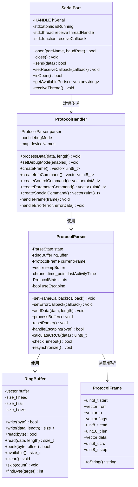
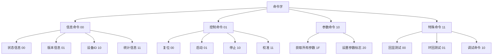
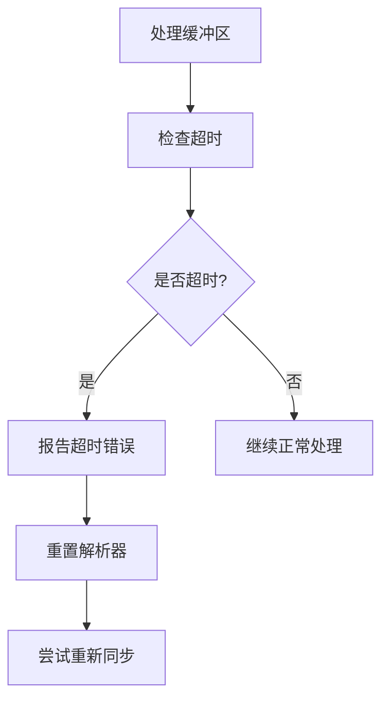
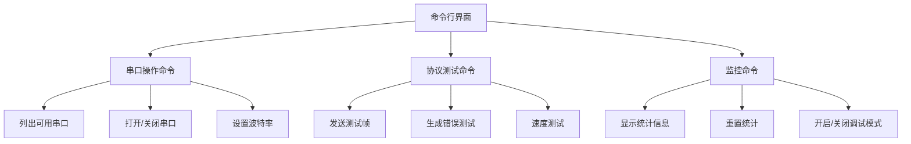

# 串口协议解析程序设计说明书

## 目录
1. [串口通讯常见问题和本程序解决方法](#1-串口通讯常见问题和本程序解决方法)
2. [通讯程序设计架构](#2-通讯程序设计架构)
3. [帧同步恢复机制、特殊转义机制和超时机制](#3-帧同步恢复机制特殊转义机制和超时机制)
4. [通讯监控系统设计说明和用途](#4-通讯监控系统设计说明和用途)

## 1. 串口通讯常见问题和本程序解决方法

### 1.1 数据丢失和错误
**问题**：串口通讯中常见数据位错误、校验错误、帧错误等导致数据丢失或损坏。

**解决方法**：
- 实现了CRC8校验机制，对每个数据帧进行校验，确保数据完整性
- 当检测到CRC错误时，能够自动重新同步帧，恢复通讯
- 统计错误率，提供实时监控功能，便于及时发现通讯问题

### 1.2 数据同步问题
**问题**：串口通讯中容易出现数据不同步，导致解析错误。

**解决方法**：
- 设计了帧起始标志(0xAA)和结束标志(0x55)，确保帧边界清晰
- 实现了强大的帧重同步机制，当检测到错误时能够快速恢复到正确的帧同步状态
- 状态机解析设计，使解析过程更加稳健，能够应对各种异常情况

### 1.3 特殊字符处理
**问题**：当数据中包含与帧边界标志相同的字节时，会导致解析错误。

**解决方法**：
- 实现了转义机制，当数据中出现帧起始、结束标志或转义字符本身时，通过转义处理确保不会被误判为控制字符
- 使用0x7D作为转义字符，并使用异或操作(XOR 0x20)处理被转义的字符

### 1.4 通讯超时
**问题**：串口通讯中可能出现数据传输中断或延迟，导致接收方一直等待。

**解决方法**：
- 实现了超时检测机制，当帧接收过程中超过设定时间(500ms)没有新数据时，自动重置解析器
- 记录最后活动时间，确保能够及时从异常状态中恢复

### 1.5 缓冲区溢出
**问题**：高速数据传输时可能导致接收缓冲区溢出。

**解决方法**：
- 实现了环形缓冲区(Ring Buffer)，高效管理数据接收和处理
- 当缓冲区接近满时，会触发溢出警告，避免数据丢失
- 可配置的缓冲区大小(默认65536字节)，可根据实际应用需求调整

## 2. 通讯程序设计架构

### 2.1 整体架构

本程序采用分层设计模式，将串口通讯和协议解析分离，提高代码的模块化和可维护性。



### 2.2 核心类说明

#### 2.2.1 SerialPort 类
负责串口的底层操作，包括打开/关闭串口、数据发送和接收。使用单独的线程进行数据接收，通过回调函数将接收到的数据传递给上层处理。

**主要功能**：
- 串口打开/关闭管理
- 数据发送
- 异步数据接收
- 串口参数配置
- 可用串口列表获取

#### 2.2.2 RingBuffer 类
环形缓冲区实现，用于高效管理数据的读写操作，避免频繁的内存分配和拷贝。

**主要功能**：
- 线程安全的数据读写
- 高效的内存管理
- 支持数据查找和跳过操作
- 缓冲区状态监控

#### 2.2.3 ProtocolFrame 类
表示一个完整的协议帧结构，包含所有帧字段。

**帧结构**：
- 起始标志(1字节): 0xAA
- 源地址(可变长度): 发送方地址
- 目标地址(可变长度): 接收方地址
- 标志位(可变长度): 控制标志
- 命令字(1字节): 指示操作类型
- 数据长度(2字节): 小端格式
- 数据(可变长度): 根据长度字段确定
- CRC校验(1字节): CRC8校验值
- 结束标志(1字节): 0x55

#### 2.2.4 ProtocolParser 类
核心协议解析器，负责将原始数据流解析为协议帧。使用状态机设计模式，能够处理各种异常情况。

**主要功能**：
- 状态机解析
- 转义字符处理
- CRC校验
- 超时检测
- 帧同步恢复
- 错误处理

#### 2.2.5 ProtocolHandler 类
协议处理器，是应用程序使用的主要接口。负责协议帧的创建、发送和接收处理。

**主要功能**：
- 协议帧创建
- 接收数据处理
- 命令分类处理
- 错误处理
- 统计信息管理
- 调试模式支持

#### 2.2.6 协议句柄层设计意图

协议句柄层（ProtocolHandler）是本系统设计中的关键层，其设计意图主要有以下几点：

**1. 简化应用层接口**
- 为应用程序提供简洁、易用的高级接口，隐藏底层协议解析的复杂性
- 应用程序无需直接处理原始字节流、转义字符和CRC校验等底层细节
- 提供语义化的命令创建函数（如createInfoCommand、createControlCommand等），使代码更具可读性

**2. 分离关注点**
- 将协议解析（ProtocolParser）和业务逻辑处理（ProtocolHandler）分离
- Parser专注于原始数据流的解析和帧重组，Handler专注于命令解释和业务处理
- 符合单一职责原则，每个类只负责自己的核心功能

**3. 提供业务层语义**
- 将底层字节和帧转换为业务层可理解的命令和响应
- 实现设备名称映射，将设备ID转换为可读的设备名称
- 提供命令分类处理（handleInfoCommand、handleControlCommand等），使业务逻辑更清晰

**4. 增强错误处理和恢复能力**
- 集中处理各类错误，提供统一的错误处理机制
- 实现错误统计和监控，便于系统健康度评估
- 在底层错误发生时提供业务层恢复策略

**5. 提供可扩展性**
- 支持自定义命令类型的扩展，无需修改底层解析器
- 允许通过配置调整协议参数（如字段长度、转义机制等）
- 便于未来增加新的协议特性和命令类型

**6. 封装调试和监控功能**
- 提供调试模式开关，便于开发和故障排查
- 集成统计信息收集和更新功能
- 提供友好的数据展示格式（如帧内容的可读字符串表示）

协议句柄层的引入使整个系统形成了清晰的三层架构：
1. **硬件接口层**（SerialPort）：负责与硬件通讯
2. **协议解析层**（ProtocolParser）：负责数据流解析
3. **业务处理层**（ProtocolHandler）：负责命令处理和业务逻辑

这种分层设计不仅提高了代码的可维护性和可测试性，还使得系统各部分可以独立演化，例如可以替换底层的通讯接口（如从串口换成网络通讯）而无需修改上层业务逻辑。

### 2.3 命令类型设计

协议支持多种命令类型，通过命令字的高两位区分：



## 3. 帧同步恢复机制、特殊转义机制和超时机制

### 3.1 帧同步恢复机制

帧同步是串口通讯中的关键问题。当通讯出现错误时，接收方需要能够重新找到帧的正确边界，恢复正常通讯。本程序实现了强大的帧同步恢复机制：

**工作原理**：
1. **错误检测**：当检测到以下错误时触发重同步：
   - CRC校验错误
   - 帧长度错误
   - 转义序列错误
   - 无效帧格式
   - 超时错误

2. **重同步过程**：
   ```mermaid
   flowchart TD
       A[检测到错误] --> B[重置解析器状态]
       B --> C[清空临时缓冲区]
       C --> D[扫描缓冲区寻找帧起始标志]
       D --> E{找到起始标志?}
       E -->|是| F[重新开始解析]
       E -->|否| G[清空缓冲区]
       G --> H[等待新数据]
   ```

3. **状态恢复**：重同步后，解析器回到`WAIT_START`状态，准备接收新的完整帧。

#### 3.1.1 帧同步恢复机制实现示例

##### 重同步函数实现

以下是帧同步恢复机制的具体实现代码示例：

```cpp
// 重新同步函数实现
void ProtocolParser::resynchronize() {
    try {
        // 首先重置解析器状态
        resetParser();
        
        // 简单方法：读取并丢弃字节直到找到起始标志
        uint8_t byte;
        bool foundStart = false;
        
        // 最多读取RING_BUFFER_SIZE个字节来寻找起始标志
        for (size_t i = 0; i < RING_BUFFER_SIZE && !foundStart; i++) {
            if (rxBuffer.read(byte)) {
                if (byte == FRAME_START) {
                    // 找到起始标志 - 将其放回缓冲区
                    rxBuffer.write(byte);
                    foundStart = true;
                }
                // 否则丢弃该字节
            } else {
                // 没有更多数据可读
                break;
            }
        }
        
        // 如果找不到起始标志，缓冲区现在为空
        if (!foundStart) {
            rxBuffer.clear();
        }
    } catch (const std::exception& e) {
        // 捕获异常以防崩溃
        std::cerr << "Exception in resynchronize: " << e.what() << std::endl;
        rxBuffer.clear();
    } catch (...) {
        // 捕获任何其他类型的异常
        std::cerr << "Unknown exception in resynchronize" << std::endl;
        rxBuffer.clear();
    }
}
```

##### 避免找错起始帧的策略

在串口通讯中，数据流中可能会出现与帧起始标志相同的字节，这可能导致解析器错误地将数据中的某个字节识别为新帧的开始。为了避免这种情况，本系统采用了以下策略：

1. **使用转义机制**：
   数据中出现的帧起始标志(0xAA)会被转义处理，因此接收方不会将数据中的0xAA误认为帧起始。这是第一道防线，但在某些情况下（如接收到损坏的数据或解析过程中出错）仍需要额外的保护机制。

2. **上下文验证**：
   在找到疑似起始标志后，解析器会继续验证后续字节是否符合协议格式。上下文验证是一种强大的技术，可通过多种方式实现：
   
   a) **基本字段验证**：
   - 检查帧字段长度是否合理
   - 验证命令字是否在有效范围内
   - 检查数据长度是否在允许范围内
   
   b) **滑动窗口技术**：
   - 滑动窗口是上下文验证的一种高级实现方式
   - 通过检查连续的多个字节来确认帧的有效性
   - 特别适用于处理连续重复字节或数据流损坏的情况

3. **完整性校验**：
   即使找到了起始标志并且后续字段看起来有效，解析器仍会等到接收到完整帧并通过CRC校验后，才确认这是一个有效帧。

##### 滑动窗口技术详解

滑动窗口是上下文验证的一种高效实现方式，它不仅检查单个字节，而是分析一系列连续字节的模式，以确定真正的帧起始位置。

**需要使用滑动窗口的典型场景**：

1. **连续重复字节场景**：
   当数据流中出现多个连续的帧起始标志(如多个0xAA)时，简单的起始标志检测无法确定哪个是真正的帧开始。

2. **数据流损坏场景**：
   当通讯线路受到电磁干扰或信号质量差时，可能导致接收到的数据中包含随机的错误字节，其中某些可能恰好与帧起始标志相同。

3. **高噪声环境**：
   在工业环境或其他高电磁干扰环境中，信号质量通常较差，需要更强大的帧同步机制。

4. **高速数据传输**：
   在高速数据传输中，短时间内接收大量数据，更容易出现同步错误，需要更可靠的帧识别机制。

5. **多设备共享通讯线路**：
   当多个设备共享同一通讯线路时，可能会接收到不属于自己的数据片段，需要准确识别有效帧。

**滑动窗口实现示例**：

```cpp
// 使用滑动窗口查找有效帧起始位置
int ProtocolParser::findFrameStartWithSlidingWindow() {
    const size_t WINDOW_SIZE = 8; // 滑动窗口大小
    const size_t MIN_HEADER_SIZE = 5; // 最小帧头大小（起始标志+源地址+目标地址+标志+命令字）
    
    // 如果缓冲区中的数据不足以形成一个最小帧头，则返回-1
    if (rxBuffer.available() < MIN_HEADER_SIZE) {
        return -1;
    }
    
    // 检查缓冲区中的每个可能位置
    for (size_t i = 0; i < rxBuffer.available() - MIN_HEADER_SIZE; i++) {
        uint8_t byte;
        
        // 检查当前位置是否为帧起始标志
        if (!rxBuffer.peek(byte, i) || byte != FRAME_START) {
            continue;
        }
        
        // 找到了起始标志，现在验证后续字节是否构成有效帧头
        bool validHeader = true;
        uint8_t headerBytes[WINDOW_SIZE];
        
        // 读取窗口大小的字节进行验证
        for (size_t j = 0; j < std::min(WINDOW_SIZE, rxBuffer.available() - i); j++) {
            if (!rxBuffer.peek(headerBytes[j], i + j)) {
                validHeader = false;
                break;
            }
        }
        
        if (!validHeader) {
            continue;
        }
        
        // 验证帧头格式
        // 1. 检查第二个字节是否是有效的设备ID
        if (!isValidDeviceId(headerBytes[1])) {
            continue;
        }
        
        // 2. 检查第三个字节是否是有效的设备ID
        if (!isValidDeviceId(headerBytes[2])) {
            continue;
        }
        
        // 3. 检查命令字是否有效
        if (!isValidCommand(headerBytes[4])) {
            continue;
        }
        
        // 如果通过了所有验证，则认为找到了有效的帧起始位置
        return i;
    }
    
    // 未找到有效帧起始位置
    return -1;
}

// 辅助函数：检查设备ID是否有效
bool ProtocolParser::isValidDeviceId(uint8_t id) {
    // 根据实际应用定义有效的设备ID范围
    return (id <= 0xFF); // 示例：所有非零ID都有效
}

// 辅助函数：检查命令是否有效
bool ProtocolParser::isValidCommand(uint8_t cmd) {
    // 根据协议定义检查命令是否有效
    uint8_t cmdType = (cmd >> 6) & 0x03; // 获取高两位
    
    // 检查命令类型是否在有效范围内
    return (cmdType <= 3); // 0-3是有效的命令类型
}
```

**滑动窗口与基本上下文验证的对比**：

| 特性 | 基本上下文验证 | 滑动窗口技术 |
|------|----------------|--------------|
| 实现复杂度 | 低 | 中 |
| 处理连续重复字节能力 | 弱 | 强 |
| 抗噪声能力 | 中 | 高 |
| 计算资源需求 | 低 | 中 |
| 适用场景 | 信号质量好，错误率低 | 信号质量差，错误率高 |

**滑动窗口技术的优化建议**：

1. **动态窗口大小**：
   根据通讯质量动态调整窗口大小，在信号良好时使用较小窗口提高效率，在信号质量差时使用较大窗口提高可靠性。

2. **模式识别增强**：
   除了简单的字段验证外，可以添加更复杂的模式识别算法，例如检查特定字段的常见值范围或数据的统计特性。

3. **概率模型**：
   对于特别复杂的环境，可以引入概率模型，为每个可能的帧起始位置分配一个概率值，选择概率最高的位置。

4. **历史数据参考**：
   利用历史成功解析的帧特征，辅助判断当前数据流中的帧边界。


对于上面的数据流 `... AA AA AA 01 02 00 03 04 00 ...`，处理过程如下：

#### 3.1.2 帧同步恢复机制的优势

1. **鲁棒性**：
   - 能够从各种错误中恢复，包括CRC错误、格式错误和超时
   - 使用多层验证确保找到真正的帧起始位置
   - 能够处理连续重复字节的情况

2. **效率**：
   - 快速丢弃无效数据，减少处理无用数据的时间
   - 使用滑动窗口技术减少不必要的重复检查
   - 优化的缓冲区管理，避免频繁的内存操作

3. **适应性**：
   - 能够处理各种异常情况，如数据丢失、噪声干扰
   - 支持不同长度和格式的帧
   - 可配置的验证策略，适应不同应用场景

4. **可靠性**：
   - 多重验证机制确保只处理有效帧
   - 错误统计和监控，便于问题诊断
   - 异常处理机制，防止系统崩溃

### 3.2 特殊转义机制

当数据中包含与帧控制字符相同的字节时，需要特殊处理以避免误判。本程序实现了高效的转义机制：

**转义规则**：
- 转义字符：0x7D
- 需要转义的字符：
  - 帧起始标志(0xAA)
  - 帧结束标志(0x55)
  - 转义字符本身(0x7D)

**转义过程**：
1. 发送时，当数据中出现需要转义的字符，先发送转义字符(0x7D)，然后发送原字符异或0x20的结果
   - 例：0xAA → 0x7D 0x8A
   - 例：0x55 → 0x7D 0x75
   - 例：0x7D → 0x7D 0x5D

2. 接收时，当检测到转义字符，将下一个字符异或0x20恢复原值
   ```mermaid
   flowchart TD
       A[接收字节] --> B{是否为转义字符?}
       B -->|是| C[标记转义活动]
       B -->|否| D{转义活动?}
       D -->|是| E{是有效的转义序列?}
       E -->|是| F[异或0x20恢复原值]
       E -->|否| G[报告转义序列错误]
       D -->|否| H[正常处理字节]
       F --> I[清除转义标记]
       I --> H
       G --> J[触发重同步]
   ```

#### 3.2.1 转义机制实现示例

##### 创建帧示例

以下是创建一个包含需要转义字符的帧的具体过程，以 `createFrame` 方法为例：

```cpp
// 假设我们要创建一个帧，其中数据部分包含需要转义的字符
// 源地址: 0x01
// 目标地址: 0x02
// 标志: 0x00
// 命令字: 0x03
// 数据: {0xAA, 0x55, 0x7D, 0x12} (包含三个需要转义的字符)

std::vector<uint8_t> createFrameExample() {
    // 1. 准备原始数据
    uint8_t fromDevice = 0x01;
    uint8_t toDevice = 0x02;
    uint8_t cmd = 0x03;
    std::vector<uint8_t> data = {0xAA, 0x55, 0x7D, 0x12};
    std::vector<uint8_t> flags = {0x00};
    
    // 2. 创建帧
    std::vector<uint8_t> frame;
    
    // 3. 添加帧起始标志(不需要转义)
    frame.push_back(FRAME_START); // 0xAA
    
    // 4. 添加源地址(可能需要转义)
    addByteWithEscaping(frame, fromDevice, true);
    
    // 5. 添加目标地址(可能需要转义)
    addByteWithEscaping(frame, toDevice, true);
    
    // 6. 添加标志(可能需要转义)
    for (uint8_t flag : flags) {
        addByteWithEscaping(frame, flag, true);
    }
    
    // 7. 添加命令字(可能需要转义)
    addByteWithEscaping(frame, cmd, true);
    
    // 8. 添加数据长度(可能需要转义)
    uint16_t len = static_cast<uint16_t>(data.size());
    addByteWithEscaping(frame, len & 0xFF, true);
    addByteWithEscaping(frame, (len >> 8) & 0xFF, true);
    
    // 9. 添加数据(可能需要转义)
    for (uint8_t byte : data) {
        addByteWithEscaping(frame, byte, true);
    }
    
    // 10. 计算CRC
    std::vector<uint8_t> crcData;
    crcData.push_back(fromDevice);
    crcData.push_back(toDevice);
    crcData.insert(crcData.end(), flags.begin(), flags.end());
    crcData.push_back(cmd);
    crcData.push_back(len & 0xFF);
    crcData.push_back((len >> 8) & 0xFF);
    crcData.insert(crcData.end(), data.begin(), data.end());
    uint8_t crc = calculateCRC8(crcData);
    
    // 11. 添加CRC(可能需要转义)
    addByteWithEscaping(frame, crc, true);
    
    // 12. 添加帧结束标志(不需要转义)
    frame.push_back(FRAME_STOP); // 0x55
    
    return frame;
}

// 添加字节到帧中，根据需要进行转义
void addByteWithEscaping(std::vector<uint8_t>& frame, uint8_t byte, bool useEscaping) {
    if (useEscaping) {
        // 检查是否需要转义
        if (byte == FRAME_START || byte == FRAME_STOP || byte == ESCAPE_CHAR) {
            // 添加转义字符
            frame.push_back(ESCAPE_CHAR); // 0x7D
            // 添加转义后的字符(原字符异或0x20)
            frame.push_back(byte ^ ESCAPE_MASK); // 异或0x20
        } else {
            // 不需要转义，直接添加
            frame.push_back(byte);
        }
    } else {
        // 不使用转义，直接添加
        frame.push_back(byte);
    }
}
```

**转义示例输出**：
上述代码生成的帧将包含以下字节序列（十六进制表示）：
```
AA 01 02 00 03 04 00 7D 8A 7D 75 7D 5D 12 XX 55
```

其中：
- `AA`: 帧起始标志
- `01`: 源地址
- `02`: 目标地址
- `00`: 标志
- `03`: 命令字
- `04 00`: 数据长度(4字节)，小端格式
- `7D 8A`: 转义后的0xAA (0x7D + (0xAA ^ 0x20))
- `7D 75`: 转义后的0x55 (0x7D + (0x55 ^ 0x20))
- `7D 5D`: 转义后的0x7D (0x7D + (0x7D ^ 0x20))
- `12`: 普通数据字节，不需要转义
- `XX`: CRC校验值（根据实际计算结果）
- `55`: 帧结束标志

##### 解析帧示例

以下是解析包含转义字符的帧的过程，以 `handleEscaping` 方法为例：

```cpp
// 解析状态机中处理单个字节的代码片段
bool handleEscaping(uint8_t& byte) {
    // 如果转义功能未启用，直接返回原字节
    if (!useEscaping) {
        return true;
    }
    
    if (escapingActive) {
        // 已经接收到转义字符，现在处理转义序列
        if ((byte ^ ESCAPE_MASK) == FRAME_START || 
            (byte ^ ESCAPE_MASK) == FRAME_STOP || 
            (byte ^ ESCAPE_MASK) == ESCAPE_CHAR) {
            // 有效的转义序列 - 恢复原始值
            byte ^= ESCAPE_MASK;
            escapingActive = false;
            return true;
        } else {
            // 无效的转义序列 - 报告错误
            reportError(ProtocolError::ESCAPED_SEQUENCE_ERROR, tempBuffer);
            escapingActive = false;
            return false;
        }
    } else if (byte == ESCAPE_CHAR) {
        // 发现转义字符 - 标记状态并等待下一个字节
        escapingActive = true;
        return false;  // 不处理这个字节，等待下一个字节
    }
    
    // 普通字节，不需要特殊处理
    return true;
}
```

**解析示例**：

假设接收到以下字节序列：
```
AA 01 02 00 03 04 00 7D 8A 7D 75 7D 5D 12 XX 55
```

解析过程如下：

1. 接收 `0xAA`：识别为帧起始标志，设置状态为 `PARSE_FROM`
2. 接收 `0x01`：普通字节，添加到 `from` 字段
3. 接收 `0x02`：普通字节，添加到 `to` 字段
4. 接收 `0x00`：普通字节，添加到 `flags` 字段
5. 接收 `0x03`：普通字节，设置为 `cmd` 字段
6. 接收 `0x04`：普通字节，设置为数据长度低字节
7. 接收 `0x00`：普通字节，设置为数据长度高字节，计算出数据长度为4字节
8. 接收 `0x7D`：识别为转义字符，设置 `escapingActive = true`，等待下一个字节
9. 接收 `0x8A`：转义序列的第二部分，计算 `0x8A ^ 0x20 = 0xAA`，添加 `0xAA` 到数据字段
10. 接收 `0x7D`：识别为转义字符，设置 `escapingActive = true`，等待下一个字节
11. 接收 `0x75`：转义序列的第二部分，计算 `0x75 ^ 0x20 = 0x55`，添加 `0x55` 到数据字段
12. 接收 `0x7D`：识别为转义字符，设置 `escapingActive = true`，等待下一个字节
13. 接收 `0x5D`：转义序列的第二部分，计算 `0x5D ^ 0x20 = 0x7D`，添加 `0x7D` 到数据字段
14. 接收 `0x12`：普通字节，添加到数据字段
15. 接收 `XX`：CRC值，验证CRC
16. 接收 `0x55`：识别为帧结束标志，完成帧解析

最终解析出的数据字段为：`{0xAA, 0x55, 0x7D, 0x12}`，与原始数据一致。

#### 3.2.2 转义机制的优势

1. **可靠性**：确保帧边界和控制字符不会在数据中被误识别
2. **效率**：只对需要转义的字符进行处理，大多数数据不需要转义
3. **透明性**：对应用层完全透明，应用程序不需要关心转义细节
4. **错误恢复**：在转义序列错误时能够快速检测并恢复
5. **通用性**：适用于各种二进制数据，不限制数据内容

### 3.3 超时机制

在通讯过程中，可能因为各种原因导致数据传输中断。超时机制确保解析器不会无限期等待：

**超时处理流程**：
1. 记录每次接收到数据的时间点
2. 在处理每个字节前检查是否超时
3. 如果当前时间与最后活动时间的差值超过设定阈值(500ms)，则触发超时处理
4. 超时处理包括：
   - 报告超时错误
   - 重置解析器状态
   - 尝试重新同步



#### 3.3.1 超时机制实现示例

以下是超时检测和处理的具体实现代码：

```cpp
// 超时检测常量定义
constexpr uint32_t PARSE_TIMEOUT_MS = 500; // 500毫秒超时阈值

// 超时检测函数
bool ProtocolParser::checkTimeout() {
    // 获取当前时间
    auto now = std::chrono::steady_clock::now();
    
    // 计算自上次活动以来经过的时间（毫秒）
    auto elapsed = std::chrono::duration_cast<std::chrono::milliseconds>(
        now - lastActivityTime).count();
    
    // 如果经过的时间超过设定阈值且当前不在等待起始标志状态
    if (elapsed > PARSE_TIMEOUT_MS && state != ParseState::WAIT_START) {
        // 报告超时错误
        reportError(ProtocolError::TIMEOUT_ERROR, tempBuffer);
        
        // 重置解析器状态
        resetParser();
        
        // 返回true表示发生了超时
        return true;
    }
    
    // 返回false表示未超时
    return false;
}

// 在处理缓冲区数据前调用超时检测
void ProtocolParser::processBuffer() {
    // 首先检查是否超时
    checkTimeout();
    
    // 处理缓冲区中的数据
    while (rxBuffer.available() > 0) {
        // 更新最后活动时间
        lastActivityTime = std::chrono::steady_clock::now();
        
        // 根据当前状态处理字节
        // ...处理代码...
    }
}

// 重置解析器状态
void ProtocolParser::resetParser() {
    state = ParseState::WAIT_START;
    currentFrame = ProtocolFrame();
    tempBuffer.clear();
    escapingActive = false;
    dataIndex = 0;
    
    // 重置时也更新最后活动时间
    lastActivityTime = std::chrono::steady_clock::now();
}
```

#### 3.3.2 超时场景示例

以下是几个典型的超时场景及其处理方式：

**场景1：帧接收中断**

假设正在接收一个帧，已经成功接收了起始标志和部分数据，但由于某种原因（如发送方突然断电、通讯线路故障），后续数据未能发送：

```
接收数据: AA 01 02 00 03 04 00 ... [通讯中断]
```

**无超时机制的情况**：
- 解析器将一直停留在`PARSE_DATA`状态
- 缓冲区中的不完整数据会一直占用内存
- 后续接收到的数据可能被错误解析
- 系统可能长时间无响应

**有超时机制的情况**：
1. 500ms后，超时检测触发
2. 报告`TIMEOUT_ERROR`错误
3. 重置解析器状态
4. 清空临时缓冲区
5. 系统恢复到等待新帧的状态

**场景2：噪声干扰**

通讯线路受到干扰，接收到了帧起始标志，但后续数据是无效的噪声：

```
接收数据: AA [噪声数据] [噪声数据] ...
```

**无超时机制的情况**：
- 解析器可能尝试将噪声数据解释为有效帧
- 可能导致错误的命令执行
- 系统状态可能变得不可预测

**有超时机制的情况**：
1. 如果噪声数据无法形成有效帧，500ms后触发超时
2. 重置解析器并重新同步
3. 避免了错误命令执行的风险

#### 3.3.3 没有超时机制的影响

超时机制是串口通讯中不可或缺的安全保障，如果没有超时机制，可能导致以下严重问题：

1. **解析器卡死**：
   - 如果帧传输中断，解析器可能永远停留在某个中间状态
   - 无法处理后续接收到的有效数据
   - 系统资源持续被占用

2. **内存资源耗尽**：
   - 不完整的帧数据会持续占用缓冲区
   - 大量不完整帧积累可能导致内存溢出
   - 长时间运行后可能导致系统崩溃

3. **错误命令执行**：
   - 部分接收的数据可能被错误解析为有效命令
   - 可能触发意外的系统行为
   - 在控制系统中可能导致危险操作

4. **系统响应延迟**：
   - 解析器忙于处理不完整帧，无法及时响应新命令
   - 用户体验显著下降
   - 实时控制系统可能无法满足时间要求

5. **难以诊断的间歇性问题**：
   - 没有超时报告，难以发现通讯问题
   - 系统可能在特定条件下随机失效
   - 问题排查难度大幅增加

#### 3.3.4 超时机制的优化策略

为了使超时机制更加高效和可靠，可以考虑以下优化策略：

1. **动态超时阈值**：
   - 根据通讯质量和数据速率动态调整超时阈值
   - 高速数据传输时使用较短超时
   - 低速或不稳定连接时使用较长超时

2. **分级超时处理**：
   - 设置多级超时阈值，针对不同严重程度采取不同措施
   - 短超时：尝试恢复当前帧
   - 中超时：重置解析器并重新同步
   - 长超时：报告通讯故障并可能重启通讯接口

3. **超时统计和预警**：
   - 记录超时发生的频率和模式
   - 当超时频率超过阈值时发出预警
   - 提供通讯质量趋势分析

4. **状态相关的超时策略**：
   - 针对不同的解析状态设置不同的超时阈值
   - 例如，接收数据阶段可能需要更长的超时时间
   - 而等待帧结束标志可能需要较短的超时时间

## 4. 通讯监控系统设计说明和用途

### 4.1 监控系统概述

通讯监控系统是本程序的重要组成部分，用于实时监控串口通讯状态，统计通讯质量，辅助调试和故障排除。

### 4.2 统计信息收集

系统收集以下统计信息：
- 总帧数：接收到的总帧数
- 有效帧数：成功解析的帧数
- CRC错误数：CRC校验失败的帧数
- 长度错误数：帧长度不合法的次数
- 超时错误数：解析过程中超时的次数
- 缓冲区溢出次数：接收缓冲区溢出的次数
- 无效帧数：格式不正确的帧数
- 转义序列错误数：转义序列错误的次数
- 字节速率：每秒接收的字节数
- 帧速率：每秒接收的帧数
- 错误率：错误帧占总帧的比例

### 4.3 调试模式

系统提供调试模式，可以输出详细的通讯信息：
- 帧内容的十六进制表示
- CRC计算过程
- 错误详情
- 状态转换

### 4.4 命令行交互界面

为方便测试和监控，系统提供了交互式命令行界面：



### 4.5 监控系统用途

1. **故障诊断**：
   - 快速定位通讯问题
   - 分析错误类型和频率
   - 评估通讯质量

2. **性能优化**：
   - 监控通讯速率
   - 分析帧处理效率
   - 识别性能瓶颈

3. **系统测试**：
   - 验证协议实现正确性
   - 测试边界条件处理
   - 模拟各种错误场景

4. **开发调试**：
   - 实时查看帧内容
   - 跟踪协议状态变化
   - 验证数据正确性

### 4.6 错误处理机制

监控系统不仅收集错误统计，还实现了完整的错误处理机制：

1. **错误检测**：在解析过程的各个阶段检测可能的错误
2. **错误报告**：通过回调机制将错误信息传递给应用层
3. **错误恢复**：根据错误类型采取相应的恢复措施
4. **错误日志**：记录详细的错误信息，便于后续分析

通过这些机制，系统能够在出现通讯问题时保持稳定运行，并提供足够的信息帮助开发人员诊断和修复问题。 